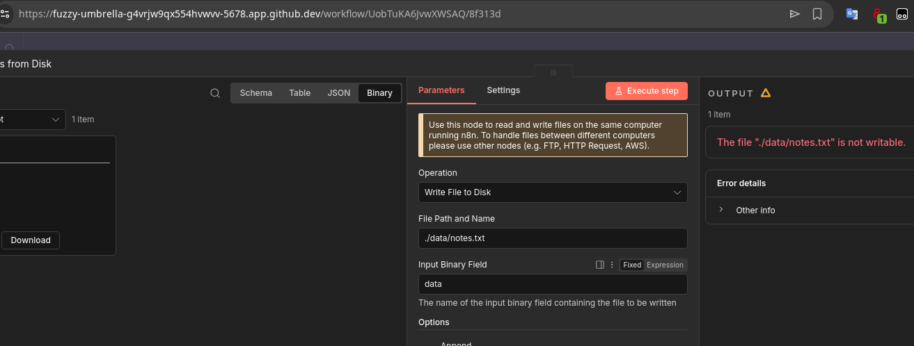

It probably does not work because of containerized environment (codespace)

I have set up two different workflows which tell a joke, provide a quoute and one which was supposed to operate on files. I could not get it to work no matter what I did.